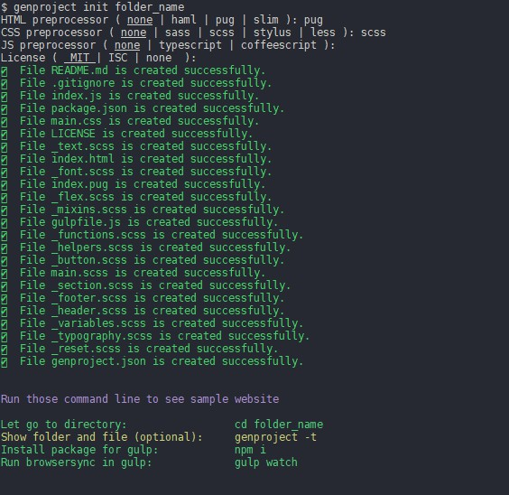
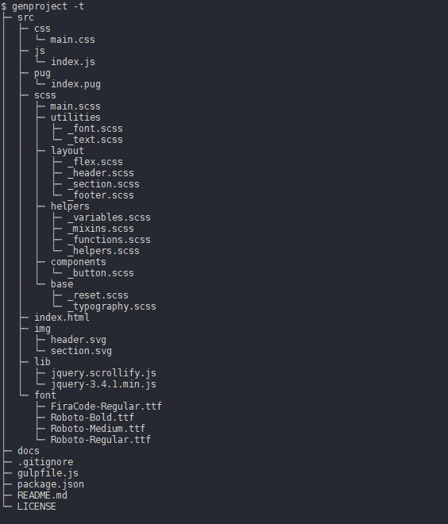

# Generate front-end project (2.1.0)

> This cli-app use to create front-end project base on preprocessor option and use gulp to run their

## Installation

You need: [Node.js](https://nodejs.org) installed on your matching.

To install

```bash
$ npm i -g @nhn.dev/generate_frontend_project
```

## Usage

After installing, execute the CLI

```bash
$ genproject init folder_name
```

This will show some preprocessor that app can create, none is default option



Then `$ cd` to your new directory and run `genproject --tree` to see all new file and folder (optional)

Run `npm install` to install all packages for gulp

After npm install successfully, run `gulp watch` to see sample website. Finally, run `gulp` to minify and map css code to docs folder

## Other

**Show help**

For a list of all the commands available in the CLI

```bash
$ genproject --help
```

**Show version**

For current of CLI app

```bash
$ genproject --version
```

**Show directory tree**

It only show directory which create by this CLI so it will not update when you create new folder or new file in this directory

```bash
$ genproject --tree
```


